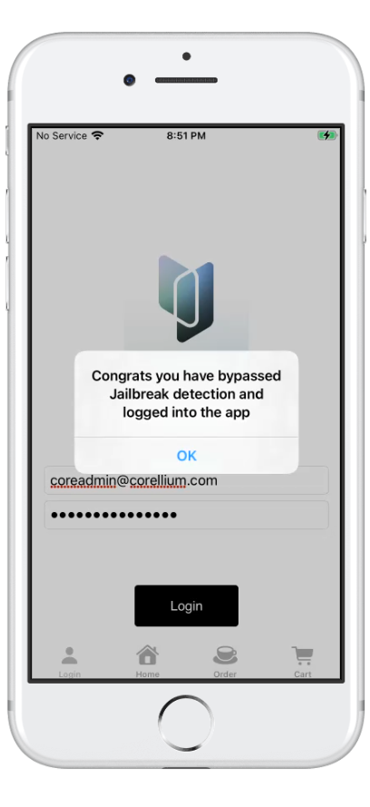

I began my work by categorising my finds and working into three of the eight OWASP MASVS groups of controls: Platform, Resilience and Storage. Below is my live findings from each, brought together into one summary.

## Platform

### MASWE-0072: Universal XSS

This one is quite obviously a feature included to demonstrate that there's an opportunity to perform an XSS.

I tested this PoC with a simple JavaScript script such as:

```html
<script> alert(document.domain) </script>
```

Clearly there's no form of sanitisation, and this pathway leads to arbitrary JavaScript code execution.

## Resilience

### MASWE-0097: Root/Jailbreak Detection Not Implemented

Jailbreak detection can be seen in Ghidra, with strings such as `/Applications/Cydia.app` present in the binary. Additionally, in the `Info.plist`, we see Cydia declared as a method for URL deeplinking, which means it most likely attempts to use a URL deeplink as well as the `fileExistsAtPath:` function to check whether that specific Cydia file exists.

One can simply use Objection, which will automatically hook methods such as `fileExistsAtPath:` and make them return `false` when it searches for the file `/Applications/Cydia.app`. On GitHub I took the Objection agent's code and edited it a little to give a demonstration of this concept.

```javascript
Interceptor.attach(
  ObjC.classes.NSFileManager["- fileExistsAtPath:"].implementation, {
    onEnter(args) {
      this.is_common_path = false;
      this.path = new ObjC.Object(args[2]).toString();
      if (this.path === "/Applications/Cydia.app") {
        console.log("hit")
        this.is_common_path = true;
      }
    },
    onLeave(retval) {
      if (!this.is_common_path) return;
      if (!retval.isNull()) return;  // already YES, nothing to do

      send(`[${ident}] fileExistsAtPath: check for ${this.path} ` +
           `returned NO, forcing YES.`);
      retval.replace(ptr(0x1));
    },
  }
);
```


## Storage

### MASWE-0001: Insertion of Sensitive Data into Logs

Using Ghidra we found the string `CorelliumizAwesome`, specifically used in:

`    os::_os_log("CorelliumizAwesome",0x12,2,0x100000000,pOVar3,pOVar4, PTR___swiftEmptyArrayStorage_1006ca400);`

We see it being leaked to the OS log.

![[promocode.png]]

Interesting note here: on a non-virtualised device, when you try to input the code it pulls up a numpad, so this vulnerability can only be exploited with a keyboard attached to the device, or if you use other methods such as clipboard.

![[promocode_empty.png]]
Bringing it together

Across all three areas the same pattern shows up: the app trusts the client far too much. On the platform side, content rendered in the WebView isn't sanitised at all, so arbitrary JavaScript runs. On resilience, the jailbreak check comes down to a single unprotected fileExistsAtPath: call, trivial to hook and flip with Objection/Frida. And on storage, sensitive data is left exposed in multiple places at once — the discount code via the OS log, and the credit card number and debug login credentials sitting in plain text in the local SQLite database and preferences plist. None of it needs any real reversing skill to get to, just poking around Ghidra strings and the app's private data.
### MASWE-0006: Sensitive Data Stored Unencrypted in Private Storage Locations

**Credit card number stored in plain text**

Simply going to the private data of the application, we can see that an order locally stores the credit card number in the database `/var/mobile/Containers/Data/Application/{ID}/Library/Application Support/OrderModel.sqlite`.

The table `ZCUSTOMERINFO` contains the following columns:

| Z_PK | Z_ENT | Z_OPT | ZCCNumber | ZFIIRSTNAME | ZUUID |
| ---- | ----- | ----- | --------- | ----------- | ----- |

Containing the credit card number in plain text.

**Debug credentials in the application**

The first clue we were given that there are credentials in the application: we used Ghidra and started searching strings for the `@` sign for a valid email address.

This technique found the string `coreadmin@corellium.com`. Now we needed to find a password.

Investigating the private data, we find in Preferences a valid login and password:

```
\h:\w \u$ cat Library/Preferences/com.corellium.Cafe.plist                                                          UserNameXPassword coreadmin@corellium.com iLoveCoffee1234
```


